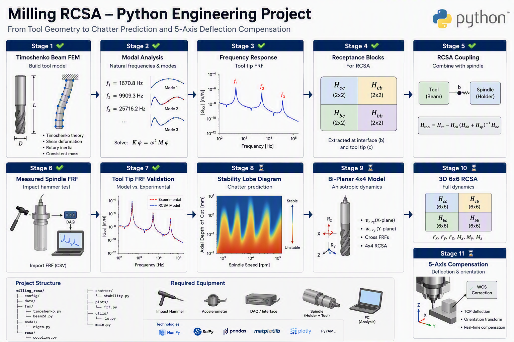

# Milling-RCSA



> Python-based engineering framework for tool dynamics, receptance coupling, chatter prediction and future 5-axis compensation.

---

# Overview

Milling-RCSA is an engineering research project developed for the prediction of milling tool dynamics, chatter stability, and future machine tool compensation applications.

The project combines analytical modeling, finite element analysis, experimental frequency response measurements, and receptance coupling techniques to estimate tool point dynamics without requiring impact testing for every spindle-holder-tool combination.

The long-term objective is to build a complete digital framework capable of:

- Tool Point FRF Prediction
- Chatter Stability Analysis
- Stability Lobe Generation
- Tool Length Optimization
- Tool-Holder-Spindle Dynamics Prediction
- 5-Axis Deflection Compensation
- Machine Tool Calibration
- Digital Twin Integration

---

# Scientific Background

This implementation follows the methodology introduced by Professor Tony L. Schmitz and collaborators for Receptance Coupling Substructure Analysis (RCSA).

Primary References:

### Tool Point Frequency Response Prediction for High-Speed Machining by RCSA (2001)

Tony L. Schmitz  
Matthew A. Davies  
Michael D. Kennedy

This work introduced the use of Receptance Coupling Substructure Analysis to predict tool point frequency response functions by combining measured and analytical component dynamics. Experimental validation was performed using multiple tool-holder configurations. 

---

### Three-Component Receptance Coupling Substructure Analysis for Tool Point Dynamics Prediction (2005)

Tony L. Schmitz  
G. Scott Duncan

This second-generation methodology separates the spindle-holder-tool assembly into:

1. Spindle-Holder Base
2. Holder Extension
3. Cutting Tool

The substructures are coupled mathematically using receptance matrices to predict tool point dynamics while minimizing experimental testing effort. 

The current project is primarily based on this three-component RCSA formulation. 

---

# Why RCSA?

In industrial machining environments, each new combination of:

- Tool Diameter
- Tool Length
- Tool Material
- Holder Type
- Collet Type

changes the structural dynamics observed at the tool tip.

Traditionally, a new impact hammer test is required for every configuration.

RCSA significantly reduces the required testing effort by:

1. Measuring the spindle dynamics once.
2. Modeling new tools analytically.
3. Coupling both subsystems mathematically.
4. Predicting tool point FRFs automatically.

This approach reduces machine downtime while enabling rapid stability assessment and process optimization. 【2-1de85b】

---

# Current Methodology

1- Tool Geometry
2- Timoshenko Beam FEM
3- Global Stiffness Matrix
4- Global Mass Matrix
5- Rotary Inertia
6- Modal Analysis
7- Mode Shapes
8- Tool Tip FRF
9- Receptance Matrices
10- RCSA Coupling
11-Stability Lobes
12-Process Optimization

---

# Current Features

## Finite Element Model

- Timoshenko Beam Element
- Consistent Mass Matrix
- Rotary Inertia Effects
- Global Assembly
- Clamped Boundary Conditions

## Modal Analysis

- Natural Frequencies
- Eigenvectors
- Mode Shapes
- Rotary Inertia Comparison

## Frequency Domain Analysis

- Tool Tip FRF
- Dynamic Stiffness Matrix
- Complex Receptance Calculation

## Receptance Coupling

- Hcc
- Hcb
- Hbc
- Hbb

Receptance block extraction has been implemented as the foundation for future spindle-tool coupling.

---

# Experimental Equipment

The following measurement equipment is recommended for model validation.

## Impact Hammer

Examples:

- PCB Impact Hammer
- Kistler Impact Hammer
- Dytran Impact Hammer

## Accelerometer

Examples:

- PCB 352C22
- PCB 356A Series

## Laser Vibrometer

Examples:

- Polytec PSV Series

## Data Acquisition System

Examples:

- National Instruments (NI)
- Dewesoft
- HBM

These instruments are commonly used for frequency response function (FRF) acquisition required for RCSA validation. 【2-1de85b】

---

# Repository Structure

```text
milling_rcsa/

├── config/
├── data/
├── docs/
│   └── images/
│
├── fem/
│   ├── timoshenko.py
│   └── beam2d.py
│
├── modal/
│
├── rcsa/
│   └── coupling.py
│
├── plots/
│
├── main.py
└── requirements.txt
```

# Development Roadmap

## Phase 1 ✅

- Timoshenko Beam FEM
- Modal Analysis
- Rotary Inertia
- Tool Tip FRF
- Receptance Blocks

## Phase 2 🚧

- Three-Component RCSA
- Spindle FRF Import
- Coupled Tool Point FRF

## Phase 3

- Stability Lobes
- Chatter Prediction
- Tool Length Optimization

## Phase 4

- Bi-Planar Beam Model
- 4×4 Receptance Matrices
- Cross-Coupled Dynamics

## Phase 5

- 3D Beam
- 6×6 RCSA
- Multi-Axis Tool Dynamics

## Phase 6

- 5-Axis Deflection Compensation
- Machine Tool Calibration
- Digital Twin Integration

---

# Vision

The final objective of Milling-RCSA is to create a complete engineering framework capable of predicting milling dynamics from geometry alone, minimizing experimental effort while enabling practical chatter avoidance, process optimization, and machine tool compensation.

---

# Educational and Research Purpose

This project has been developed primarily for:

- Engineering education
- Academic research
- Manufacturing process development
- Machine tool dynamics studies
- Receptance Coupling Substructure Analysis (RCSA)
- Chatter prediction research

The software is intended as an open learning and development platform for students, researchers, and manufacturing engineers interested in machining dynamics and structural modeling.

---

# Disclaimer

This software is provided for educational, research, and engineering development purposes only.

The results generated by this software should not be considered a substitute for:

- Experimental validation
- Professional engineering judgment
- Machine tool manufacturer recommendations

Users are responsible for validating all simulation results before industrial application.

The authors assume no responsibility for:

- Machine damage
- Tool breakage
- Production downtime
- Financial losses
- Personal injury
- Any indirect or consequential damages arising from the use of this software.

---

# License

This project is licensed under the MIT License.

See the LICENSE file for details.

---

## Recent changes

- 2026-08-16: Removed duplicate receptance_blocks definition from fem/beam2d.py to avoid confusion; retained single canonical implementation.
